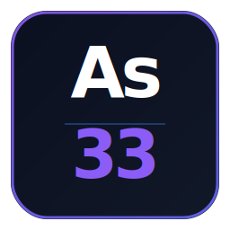

<div align="center">



# arsenic-docs

**Documentation website for [`@periodic/arsenic`](https://www.npmjs.com/package/@periodic/arsenic)**  
Built with Next.js 14 · Deployed at [periodic.dev](https://periodic.dev)

[](https://nextjs.org)
[](https://www.typescriptlang.org)
[](https://tailwindcss.com)
[](LICENSE)

---

[**Live Site →**](https://periodic.dev) · [**npm Package →**](https://www.npmjs.com/package/@periodic/arsenic) · [**Report a Doc Bug →**](https://github.com/thaku7469/arsenic-docs/issues/new?template=doc_bug.md) · [**Request a Page →**](https://github.com/thaku7469/arsenic-docs/issues/new?template=content_request.md)

</div>

---

## What is this?

This repository contains the full source code for the `@periodic/arsenic` documentation website — a custom-built Next.js App Router site with no doc framework dependency (no Nextra, no Docusaurus). Everything from the syntax highlighter to the search modal is written from scratch and designed to match the `@periodic` design language.

The site documents:

- **30+ signals** — semantic runtime signals emitted by the library (`hot_path`, `n_plus_one`, `slow_query`, etc.)
- **4 database adapters** — Mongoose, Prisma, PostgreSQL (`pg`), Redis
- **2 framework integrations** — Express, Fastify
- **Exporters** — OpenTelemetry, Datadog, Prometheus, JSON
- **Full API reference** — `createMonitor`, `ForgeEvent`, `SignalSeverity`

---

## Table of Contents

- [Tech Stack](#tech-stack)
- [Project Structure](#project-structure)
- [Getting Started](#getting-started)
- [Key Components](#key-components)
- [Adding Content](#adding-content)
  - [Adding a new doc page](#adding-a-new-doc-page)
  - [Adding a new signal page](#adding-a-new-signal-page)
  - [Adding to the search index](#adding-to-the-search-index)
- [Design System](#design-system)
- [Scripts](#scripts)
- [Deployment](#deployment)
- [Contributing](#contributing)
- [License](#license)

---

## Tech Stack

| Layer | Technology |
|---|---|
| Framework | [Next.js 14](https://nextjs.org) (App Router, RSC) |
| Language | [TypeScript 5](https://www.typescriptlang.org) — strict mode |
| Styling | [Tailwind CSS 3.4](https://tailwindcss.com) + OKLCH CSS variables |
| UI Primitives | [Radix UI](https://radix-ui.com) (Tabs, Collapsible, Separator, Slot) |
| Icons | [Lucide React](https://lucide.dev) |
| Search | [Fuse.js](https://fusejs.io) — client-side fuzzy search |
| Theming | [next-themes](https://github.com/pacocoursey/next-themes) — system default |
| Utilities | `clsx`, `tailwind-merge`, `class-variance-authority` |
| Code Highlighting | Custom multi-pass highlighter — zero dependency, no Shiki/Prism |
| Font Stack | Roboto Slab (display) · Roboto (body) · Roboto Mono (code) |

---

## Project Structure

```
arsenic-docs/
├── app/
│   ├── layout.tsx                  # Root layout — fonts, theme, OpenGraph meta
│   ├── page.tsx                    # Landing page (/, hero + features + signals preview)
│   ├── globals.css                 # OKLCH design tokens + prose-doc typography
│   ├── ecosystem/
│   │   └── page.tsx                # @periodic ecosystem browser
│   └── docs/
│       ├── layout.tsx              # Docs shell — Sidebar + Breadcrumbs + TOC
│       ├── page.tsx                # /docs — Introduction
│       ├── installation/
│       ├── quickstart/
│       ├── configuration/
│       ├── core-concepts/
│       ├── event-examples/
│       ├── patterns/
│       ├── adapters/
│       │   ├── page.tsx            # Adapters overview
│       │   ├── mongoose/
│       │   ├── prisma/
│       │   ├── pg/
│       │   └── redis/
│       ├── frameworks/
│       │   ├── express/
│       │   └── fastify/
│       ├── exporters/
│       ├── api-reference/
│       ├── setup/
│       └── signals/
│           ├── page.tsx            # Signals index — all 30+ signals
│           ├── hot-path/
│           ├── n-plus-one/
│           ├── unbounded-query/
│           └── ...                 # 27 more signal pages
│
├── components/
│   ├── Navbar.tsx                  # Top navigation + Search trigger
│   ├── Sidebar.tsx                 # Desktop sidebar (64px wide fixed)
│   ├── MobileSidebar.tsx           # Mobile slide-out drawer
│   ├── Breadcrumbs.tsx             # Automatic breadcrumb trail
│   ├── TableOfContents.tsx         # "On this page" — right-side anchor nav
│   ├── Search.tsx                  # Cmd+K fuzzy search modal (Fuse.js)
│   ├── CodeBlock.tsx               # Syntax-highlighted code with copy button
│   ├── Callout.tsx                 # Tip / Info / Warning / Danger callouts
│   ├── SignalCard.tsx              # Signal display card (compact + full)
│   └── ThemeToggle.tsx             # Light/dark/system toggle
│
├── lib/
│   ├── navigation.ts               # Sidebar nav config + signalsList
│   ├── search-index.ts             # Static Fuse.js search records (~50 entries)
│   └── utils.ts                    # cn() helper (clsx + tailwind-merge)
│
├── public/
│   ├── logo.svg
│   └── og.png                      # 1200×630 OpenGraph image
│
├── generate-signals.mjs            # Code-gen script — scaffolds new signal pages
│
├── ARCHITECTURE.md                 # System design + component decisions
├── CONTRIBUTING.md                 # Contribution guide
├── CHANGELOG.md                    # Release history
└── LICENSE
```

---

## Getting Started

### Prerequisites

- Node.js 18.17+ (LTS)
- npm 9+

### Install & run

```bash
# 1. Clone the repo
git clone https://github.com/thaku7469/arsenic-docs.git
cd arsenic-docs

# 2. Install dependencies
npm install

# 3. Start the dev server
npm run dev
```

Open [http://localhost:3000](http://localhost:3000).

### Build for production

```bash
npm run build
npm run start
```

The build output goes to `.next/`. There are no environment variables required for a basic build — the site is fully static-friendly.

---

## Key Components

### `<CodeBlock />`

Custom syntax highlighter with zero runtime dependencies. Highlights TypeScript, JavaScript, JSON, Bash, and CSS using a multi-pass string-protection algorithm (strings are masked before keyword replacement to prevent false matches).

```tsx
import { CodeBlock } from '@/components/CodeBlock'

<CodeBlock
  language="typescript"
  filename="server.ts"           // optional — shows a filename tab
  showLineNumbers                // optional
  code={`const monitor = createMonitor({ slowQueryThresholdMs: 200 })`}
/>
```

### `<Callout />`

Four types: `tip` (green), `info` (blue), `warning` (amber), `danger` (red). Renders a left-bordered card with icon, title, and body.

```tsx
import { Callout } from '@/components/Callout'

<Callout type="warning" title="Order matters">
  Call <code>mongooseAdapter()</code> after <code>mongoose.connect()</code>.
</Callout>
```

### `<SignalCard />`

Used on signal index and individual signal pages. Accepts `compact` prop for the index grid view and full props (`causes`, `fixes`, `detail`) for individual pages.

```tsx
import { SignalCard } from '@/components/SignalCard'

<SignalCard
  name="hot_path"
  severity="critical"
  summary="Slow query on a frequently hit execution path"
  detail="This query appears on a hot execution path..."
  causes={['Missing indexes', 'No caching layer']}
  fixes={['Add indexes', 'Cache with Redis']}
/>
```

### `<Search />`

Triggered by `Cmd+K` / `Ctrl+K` or the search button in the Navbar. Runs Fuse.js fuzzy search over `lib/search-index.ts`. Fully keyboard-navigable (`↑↓` to move, `Enter` to navigate, `Esc` to close).

### `<TableOfContents />`

Queries `h2` and `h3` elements inside `article.prose-doc` after page render. Uses `IntersectionObserver` to track the active heading. Only renders at `xl` breakpoint and above. Hides itself if fewer than 2 headings are found.

### `<Breadcrumbs />`

Reads the current pathname from `usePathname()` and resolves segment labels from `lib/navigation.ts`. Falls back to title-casing the URL segment if a label isn't found. Renders nothing on single-segment paths (e.g. `/docs`).

---

## Adding Content

### Adding a new doc page

1. Create the directory and `page.tsx` under `app/docs/`:

```bash
mkdir -p app/docs/your-section/your-page
touch app/docs/your-section/your-page/page.tsx
```

2. Write the page using the `prose-doc` article wrapper and existing components:

```tsx
// app/docs/your-section/your-page/page.tsx
import type { Metadata } from 'next'
import { CodeBlock } from '@/components/CodeBlock'
import { Callout } from '@/components/Callout'

export const metadata: Metadata = { title: 'Your Page Title' }

export default function YourPage() {
  return (
    <article className="prose-doc">
      <h1>Your Page Title</h1>
      <p>Introduction paragraph…</p>

      <h2>Section heading</h2>
      <p>Content…</p>

      <CodeBlock language="typescript" code={`// example`} />

      <Callout type="info" title="Good to know">
        A helpful note.
      </Callout>
    </article>
  )
}
```

3. Add the page to the sidebar in `lib/navigation.ts`:

```ts
// lib/navigation.ts
{
  section: 'Your Section',
  items: [
    { label: 'Your Page Title', href: '/docs/your-section/your-page' },
  ],
},
```

4. Add a search record in `lib/search-index.ts`:

```ts
{
  title: 'Your Page Title',
  href: '/docs/your-section/your-page',
  section: 'Your Section',
  description: 'One sentence describing what this page covers.',
  tags: ['keyword1', 'keyword2'],
},
```

### Adding a new signal page

New signal pages should be generated with the scaffold script rather than created manually:

```bash
# 1. Add your signal entry to the `signals` array in generate-signals.mjs
# 2. Run the generator — it skips files that already exist
node generate-signals.mjs

# 3. Edit the generated page to add real code examples
# app/docs/signals/your-signal/page.tsx

# 4. Add to search index
# lib/search-index.ts

# 5. The signal is already in lib/navigation.ts via signalsList — no manual step needed
```

The generator creates a fully-formed page using the `SignalCard` component with all props pre-filled from the signal definition. It will **never overwrite existing files**, so it is safe to re-run.

### Adding to the search index

The search index in `lib/search-index.ts` is a manually maintained TypeScript array. Each record is a `SearchRecord`:

```ts
interface SearchRecord {
  title: string        // Shown as the result title (use exact signal/page name)
  href: string         // Route — must match the actual Next.js page path
  section: string      // Section label shown above the result
  description: string  // One-line description — shown below the title
  tags?: string[]      // Extra keywords for fuzzy matching
}
```

Fuse.js is configured with weights: `title` (0.5), `description` (0.3), `tags` (0.2). Add synonyms, common misspellings, and related terms to `tags` for better recall.

---

## Design System

The entire colour system is built on [OKLCH](https://developer.mozilla.org/en-US/docs/Web/CSS/color_value/oklch) tokens defined in `app/globals.css`. All Tailwind colour classes (`text-foreground`, `bg-card`, `border-border`, etc.) resolve to these variables.

### Token reference

| Token | Light | Dark | Usage |
|---|---|---|---|
| `--background` | `oklch(0.985 0.002 264)` | `oklch(0.08 0.01 264)` | Page background |
| `--foreground` | `oklch(0.145 0.02 264)` | `oklch(0.97 0.005 264)` | Body text |
| `--primary` | `oklch(0.488 0.243 264)` | `oklch(0.623 0.214 259)` | Blue accent, links, active states |
| `--card` | `oklch(1 0 0)` | `oklch(0.12 0.015 264)` | Card / sidebar background |
| `--muted` | `oklch(0.96 0.004 264)` | `oklch(0.17 0.02 264)` | Subtle backgrounds |
| `--border` | `oklch(0.90 0.005 264)` | `oklch(0.22 0.02 264)` | Borders, dividers |
| `--sidebar` | `oklch(0.97 0.003 264)` | `oklch(0.10 0.012 264)` | Sidebar background |

### Typography classes

All doc page content uses the `prose-doc` CSS class applied to the `<article>` wrapper. This class styles `h1`, `h2`, `h3`, `p`, `ul`, `ol`, `table`, `a`, `code`, and `strong` elements without any Tailwind Typography plugin dependency.

### Severity colours

Signal severity is consistently represented across `SignalCard`, `Search`, and `Sidebar` using three semantic colours:

| Severity | Colour | OKLCH |
|---|---|---|
| `critical` | Red | `oklch(0.7 0.21 22)` |
| `warning` | Amber | `oklch(0.8 0.18 80)` |
| `info` | Blue | `oklch(0.7 0.15 260)` |

---

## Scripts

| Command | Description |
|---|---|
| `npm run dev` | Start Next.js dev server on port 3000 |
| `npm run build` | Production build |
| `npm run start` | Serve the production build |
| `node generate-signals.mjs` | Scaffold new signal pages (skips existing files) |

---

## Contributing

Contributions are welcome — especially doc improvements, additional signal detail, and code example corrections. Please read [`CONTRIBUTING.md`](CONTRIBUTING.md) before opening a PR.

**Quick contribution types:**

| Type | What to do |
|---|---|
| Fix a typo or factual error | Edit the relevant `page.tsx` and open a PR |
| Add a missing code example | Edit the relevant page, follow existing `CodeBlock` patterns |
| Improve a signal page | Edit `app/docs/signals/<slug>/page.tsx` |
| Add a missing search term | Edit `lib/search-index.ts` |
| Report a content bug | [Open an issue](https://github.com/thaku7469/arsenic-docs/issues/new) |

---

## License

MIT © [Uday Thakur](https://udaythakur.site)

The documentation content (all `.tsx` files under `app/docs/`) is also MIT licensed and may be freely referenced or adapted with attribution.

---

<div align="center">

Part of the [`@periodic`](https://www.npmjs.com/~uday-thakur) ecosystem · Built by [Uday Thakur](https://udaythakur.site)

</div>
